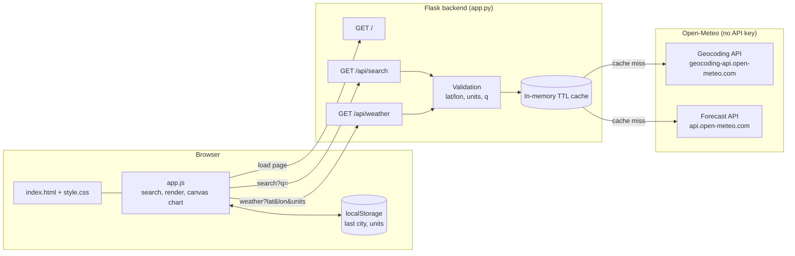
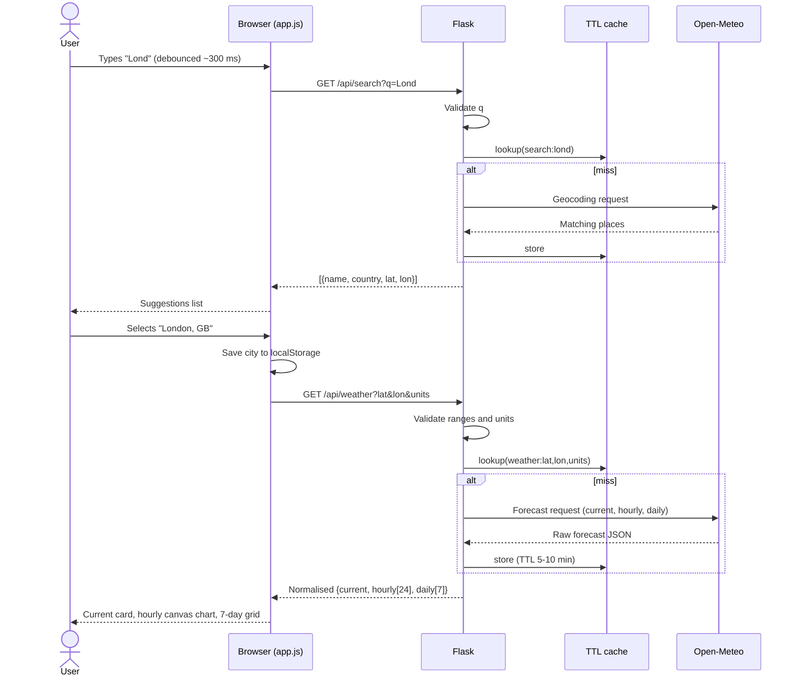
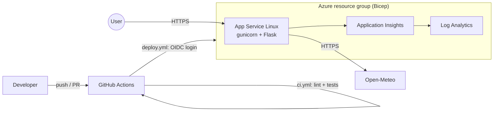

## Plan: Weather Dashboard (Flask + Open-Meteo)

Flask serves the page and proxies Open-Meteo's geocoding and forecast APIs (no API key needed). The vanilla HTML/CSS/JS frontend calls only the Flask endpoints.

**Steps**
1. **Backend** in [app.py](app.py), which is currently empty:
   - `GET /` renders `templates/index.html`.
   - `GET /api/search?q=` calls `geocoding-api.open-meteo.com/v1/search` and returns name, country, lat and lon.
   - `GET /api/weather?lat=&lon=&units=` calls `api.open-meteo.com/v1/forecast`. It requests current temperature, humidity, wind, weather code, a 24-hour hourly temperature series, and 7-day daily max/min, precipitation and weather code.
   - Validate lat/lon ranges and the units value, use `requests` with a timeout, and return JSON errors with 400/502 status codes.
   - Add a small in-memory cache with a short TTL.
2. **Frontend template**, `templates/index.html` (*parallel with 3 and 4*):
   - A search box with a suggestions list and a °C/°F toggle.
   - A current-conditions card.
   - An hourly chart canvas.
   - A 7-day forecast grid.
3. **Styles**, `static/style.css`: responsive card layout with CSS grid.
4. **Script**, `static/app.js` (*parallel with 2 and 3*):
   - Debounced city search.
   - Fetch weather and render the cards.
   - Map WMO weather codes to descriptions and emoji.
   - Draw the hourly chart on a canvas, with no external libraries.
   - Remember the last city in `localStorage`.
   - Show error and loading states.
5. **Dependencies**, `requirements.txt`: Flask and requests.

**Relevant files**
- [app.py](app.py): routes and the Open-Meteo calls.
- New files: `templates/index.html`, `static/style.css`, `static/app.js`, `requirements.txt`.

**Verification**
1. Run `pip install -r requirements.txt` and then `python app.py`.
2. Open http://127.0.0.1:5000, search "London", and confirm the current card, hourly chart and 7-day grid render.
3. Test `/api/weather?lat=999&lon=0`, which should return 400.
4. Toggle °C/°F and confirm values update.

**Decisions**
- No frontend framework and no charting library.
- Out of scope: user accounts, a database, and deployment.

## Architecture

## Data flow: city search and weather

## Error paths

| Failure | Backend response | UI behaviour |
|---|---|---|
| Invalid or missing params | 400 `{error}` | Inline validation message |
| Open-Meteo timeout or 5xx | 502 `{error}` | "Weather service unavailable" with retry |
| No geocoding results | 200 `[]` | "No cities found" |

## Future deployment view (Azure, Bicep, GitHub Actions)

